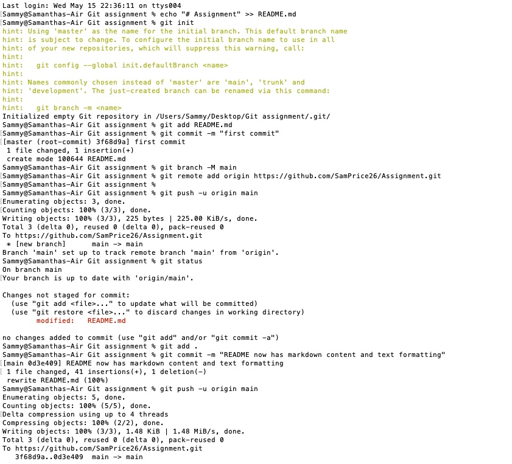
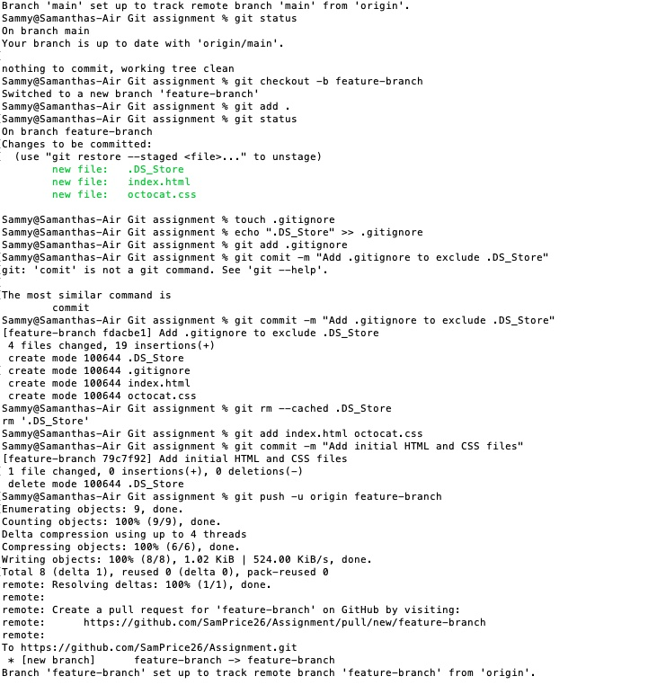
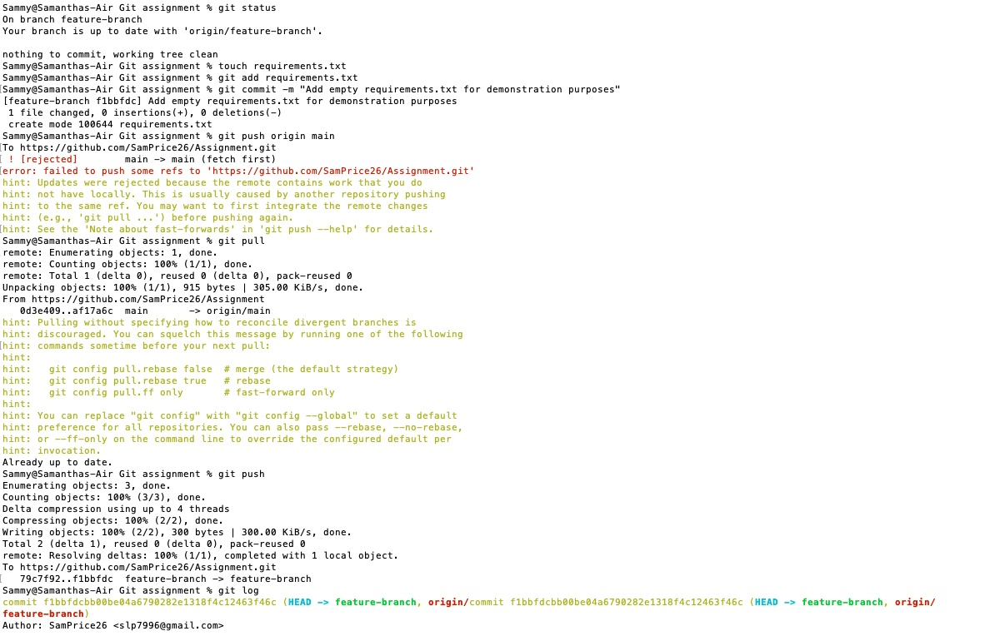
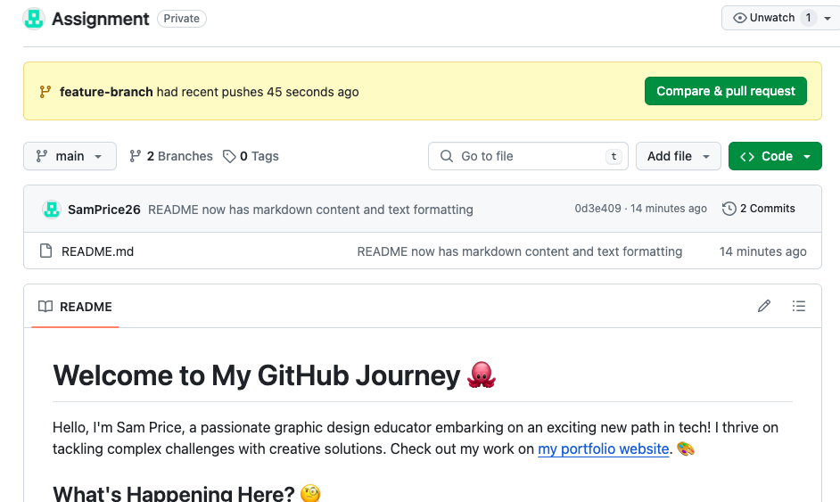
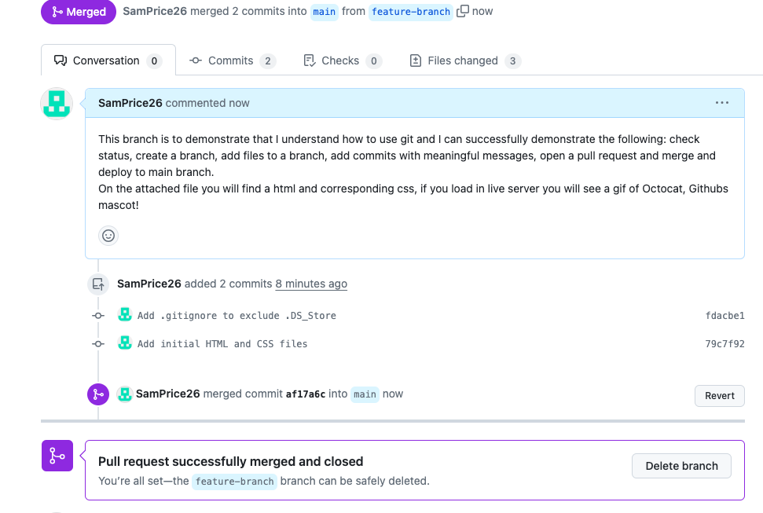

# Welcome to My GitHub Journey 🐙 

Hello, I'm Sam Price, a passionate graphic design educator embarking on an exciting new path in tech! I thrive on tackling complex challenges with creative solutions. Check out my work on [my portfolio website](https://samprice26.github.io/Portfolio/). 🎨 

## What's Happening Here? 🧐 

In this repository, I'll demonstrate key GitHub functionalities to manage and track changes to projects. Here’s what you can expect:

### Git and GitHub Demonstrations 

- **Checking the Status**  📈 
  `git status` helps us peek into the current state of our repository. It shows which changes are staged, which are not, and what the branch status is.

- **Creating a Branch**  🌿 
  Branches are crucial for managing new features or tests. They allow us to diverge from the main project workflow without disrupting the functional version.

- **Adding Files to a Branch**  🍃 
  Once a branch is created, we add new or modified files to it. This way, we can work on different parts of the project without overlapping.

- **Committing Changes**  📝 
  Each commit is a snapshot of our work. Meaningful commit messages are like a good book summary; they tell future us (or other developers) what happened.

- **Opening a Pull Request**  🔄 
  Pull requests let us tell others about the changes we've pushed to a GitHub repository. It’s a place to discuss and review the potential modifications.

- **Merging and Deploying**  🚀 
  Once our changes are reviewed and approved, we merge them with the main branch, making our contributions a part of the project’s living history.

### Screenshots 📸 

I've captured some key moments in this process. Here they are for you to see how it all unfolds!

## Special Files in This Repository

- **.gitignore**  
  Not everything in a directory should go into a Git repository. The `.gitignore` file is where we specify the files or directories that Git should ignore. It keeps our repository clean and free from unnecessary files like temporary files or build folders.

- **requirements.txt**  
  When working with Python, `requirements.txt` is essential for managing project dependencies. It lists the libraries and their versions needed for the project to run effectively. This way, anyone who clones the repository knows exactly what to install.
